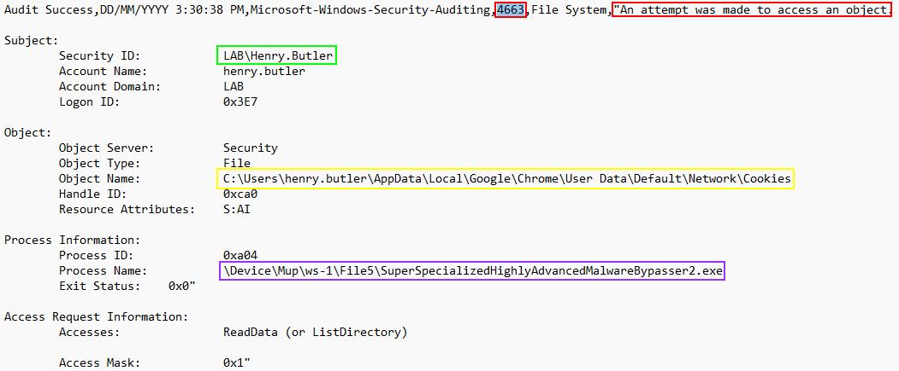

# Cookie Theft and RMM (Realtime Monitoring and Management) Takeover

[*Download the log file to follow along*](./logs/cookie_theft.csv)

- At this point we know that the attacker is trying to **pivot** in the network.

- If the attacker got another user to run a **malicious file**, what will they do next? Well, this user was a slightly more privileged user and may have access to information an attacker may want.

- Let's take the **security logs** from the workstation that **Paul Bowman** pivoted to and see if we can see what the malicious executable is doing. 

>[!NOTE] 
>Once again, the logs file is unique. Please **download** with the link above and open with notepad or another text editor.**

- If the attacker is running commands and scripts to access **sensitive information** our audit logs should contain evidence of what happened.

- The Audit number that indicates something has attempted to access an object is **"4663"**. Use **"ctrl + f"** and type **"4663"** and tab through the logs. If the attacker did access a sensitive file, it will have the process name of **"SuperSpecializedHighlyAdvancedMalwareBypasser2.exe"**.

- We have found a very important **Audit** event.

<pre>
Contains Process 4663 and the text "An attempt was made to access an object". This indicates that someone has tried
to access something, but we need more information to go off of to get the full story.
</pre>

<pre>
Contains the username henry.butler. We know already that henry.butler was the next user to get compromised.
</pre>

<pre>
This shows the directory accessed. It looks like something has accessed the cookies of Google Chrome, but the only
program that should do that is Chrome itself. If another program has accessed it, then we know that the users'
cookies have
been stolen.
</pre>

<pre>
Shows which program accessed the folder and files. It looks like "SuperSpecializedHighlyAdvancedMalwareBypasser2.exe"
is the culprit. This is not good. The attacker has just stolen the cookies for henry.butler who we know has access
to our RMM.
</pre>

 

- It looks like the attacker is dumping the **users'** cookies to gain access to accounts on the web. Does this user have access to any important accounts or frameworks? **Yes!**  This user has access to a **RMM** that manages the domain. If an attacker gains access to the RMM, then all of our computers may get taken over.

Not to worry though, right? Most **RMM** uses **MFA** and there's nothing to worry about.

Right?

- Unfortunately, the cookie theft and reuse occur attackers are hijacking a session that already went through **MFA**, so the attacker can effectively bypass **MFA**. But before we panic let's check our **RMM** logs and see if the attacker has done anything.

***                                                                 
<b><i>Continuing the course?  [Next Lab](/IntroClassFiles/Tools/IntroClass/AZURE-MSP-WRITEUP-main/rmm_takeover.md)</i></b>

<b><i>Want to go back?  [Previous Lab](/IntroClassFiles/Tools/IntroClass/AZURE-MSP-WRITEUP-main/ws_3_security_logs.md)</i></b>

<b><i>Looking for a different lab?  [Lab Directory](/IntroClassFiles/navigation.md)</i></b>

***Finished with the Labs?***

Please be sure to destroy the lab environment!

[Click here for instructions on how to destroy the Lab Environment](/IntroClassFiles/Tools/IntroClass/LabDestruction/labdestruction.md)

---

